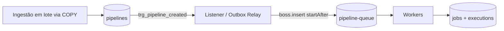

# Pareto Workflow Engine

Motor de execução de workflows em lote: ingere pipelines em massa (100k) via `COPY`, enfileira sem latência com outbox transacional (`LISTEN/NOTIFY`) + pg-boss e executa cada pipeline em 3 steps, registrando jobs e execuções no PostgreSQL.

## Fluxo



1. **Ingestão** — `createPipelinesBulk` grava o lote em `pipelines` com `COPY` (`pg-copy-streams`).
2. **Outbox** — a trigger `trg_pipeline_created` emite `pg_notify('pipeline_created', { id, scheduled_at })` no commit da transação.
3. **Relay** — `src/queue/listener.ts` escuta o canal, bufferiza as notificações e enfileira em lotes com `boss.insert(..., { startAfter })`.
4. **Execução** — os workers reivindicam a `pipeline-queue`, rodam os 3 steps genéricos e registram `jobs` e `executions`, tudo em uma transação por lote.

## Requisitos

- Node.js >= 22.12
- Docker + Docker Compose

## Como rodar

```bash
npm install
cp .env.example .env
npm run docker:up
npm run db:init
npm run seed:dataset
```

Depois, em dois terminais:

```bash
npx tsx src/index.ts   # workers + listener do outbox
npm run ingest         # grava os 100k pipelines via COPY
```

Saída esperada do runner:

```
[worker] Workers registrados na fila "pipeline-queue".
[outbox] Listener ativo no canal "pipeline_created".
Runner do Desafio 2 em execucao. Ctrl+C para encerrar.
```

> [!NOTE]
> `LISTEN/NOTIFY` não é durável: notificações só chegam a listeners conectados no momento do commit. Com o runner fora do ar, os eventos se perdem — para reexecutar do zero, limpe o banco e rode o ingest novamente.

## Scripts

| Script | O que faz |
| --- | --- |
| `npm run docker:up` / `docker:down` | Sobe/derruba o PostgreSQL 16 (porta 5432) |
| `npm run db:init` | Aplica `src/db/schema.sql` (idempotente) |
| `npm run seed:dataset` | Gera `data/bulk_payload_100k.json` com 100.000 pipelines |
| `npm run ingest` | Lê o dataset e grava via COPY, com métricas de throughput |
| `npm run e2e` | Executa o fluxo E2E cronometrado (`console.time('e2e')`) |
| `npm run dev` | Servidor HTTP stub do handler de ingestão |
| `npm run typecheck` | `tsc --noEmit` |

## Estrutura

```
src/
├── config/env.ts      # carrega .env e valida DATABASE_URL
├── db/                # pool (pg), schema.sql e db:init
├── engine/            # steps genéricos, executor em lote e state machine
├── queue/             # singleton do pg-boss, listener do outbox e workers
├── scripts/           # seed do dataset e ingest
├── services/          # createPipelinesBulk (COPY)
├── types/             # tipos do payload
├── index.ts           # runner (workers + listener)
└── server.ts          # handler HTTP (stub)
```

## Modelo de dados

| Tabela | Papel |
| --- | --- |
| `pipelines` | Payload JSONB, `status`, `scheduled_at`; trigger de outbox no insert |
| `jobs` | 3 steps por pipeline: `validate-payload`, `aggregate-items`, `finalize-pipeline` |
| `executions` | Uma por job: `status`, `payload_ref`, `expires_at` |

## Notas

- pg-boss 12 é ESM-only: use `import { PgBoss } from 'pg-boss'`.
- O relay nunca faz um `send` por notificação; ele agrupa em lotes para não estourar o pool do pg-boss.
- Transições de status de execução usam escrita condicional (`UPDATE ... WHERE status = $1`), então transições concorrentes não sobrescrevem estado.

## Ajuda

Dúvidas e problemas: abra uma issue em [amorimluiz/pareto-workflow-engine](https://github.com/amorimluiz/pareto-workflow-engine). Mantido por [@amorimluiz](https://github.com/amorimluiz).
